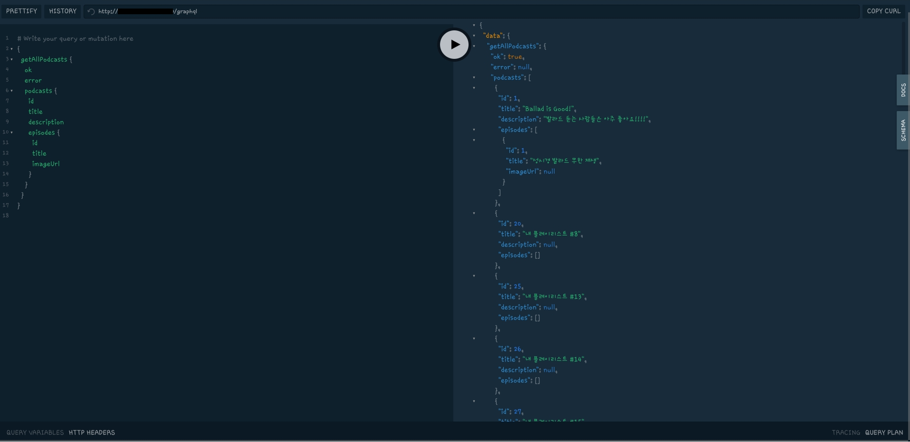
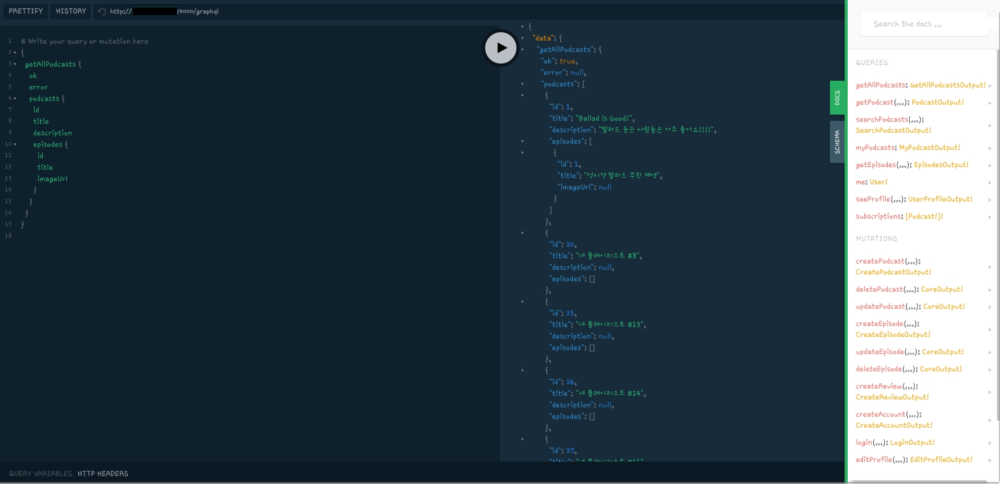
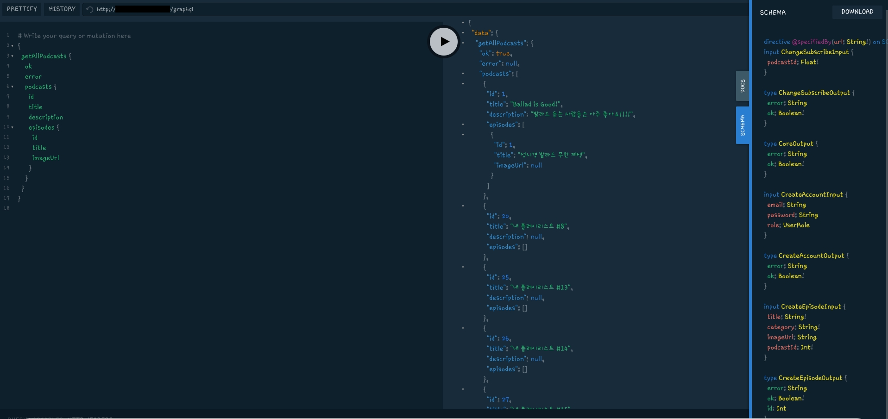

<p align="center">
  <a href="http://nestjs.com/" target="blank"></a>
</p>

# Hi NestJS : Nest Study용 repo
## NestJS + Typescript + Apollo GraphQL + TypeORM + PostgreSQL

```
{
  "name":"NestJS for Beginners",
  "skills": [
    "Typescript"
    "NestJS"
    "Jest"
    "OOP"
  ]
}
```

## 기능
- NestJS Architecture
- Modules
- Controllers
- Providers
- Pipes
- Dependency Injection
- End to End Testing
- Unit Testing

## 스크린샷





